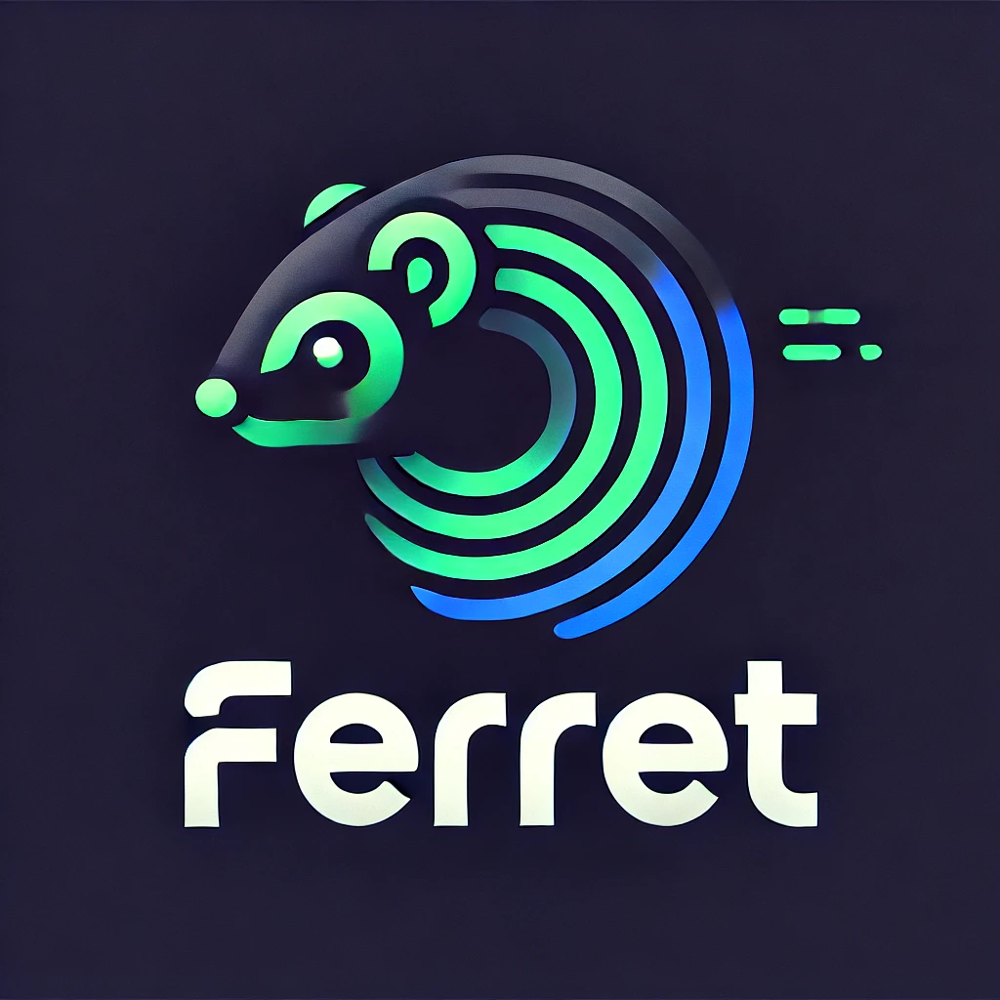

## Ferret - The one stop scout for "Resume - JobDesciption" matching. [Powered by Langchain and LlamaParse].

Ferret is a comprehensive resume and job description (JD) evaluation system designed to streamline the hiring process. By leveraging AI-driven insights, the tool matches resumes against job descriptions based on key technical skills, qualifications, and experience. It also integrates GitHub data to enhance the evaluation of candidates with technical project experience.

---

## Features

### Resume and JD Parsing
- Extracts key details from resumes, including:
  - Candidate name and email.
  - Technical skills and certifications.
  - Projects with metrics and experience details.
- Summarizes job descriptions to identify:
  - Required qualifications and experience.
  - Technical skills and mandatory/good-to-have attributes.

### GitHub Integration
- Identifies GitHub links in resumes and retrieves:
  - Repository titles.
  - README content for project details.
  - Languages used in projects.
- Incorporates GitHub data into the evaluation to better assess technical expertise.

### Evaluation and Scoring
- Compares resumes with JDs based on:
  - Skills and experience alignment.
  - Project relevance using GitHub data.
- Provides a score (out of 100) for each candidate.
- Displays the top candidates based on the evaluation.

### Streamlined User Interface
- Upload job descriptions and multiple resumes in PDF format.
- Specify the number of top candidates (K) to display.
- Ensures user actions are responsive:
  - "Evaluate" button activates only when all inputs are provided.
  - Disables during evaluation to prevent duplicate submissions.

---

## How It Works

1. **Upload Documents**:
   - Upload the job description as a PDF.
   - Upload multiple resumes in PDF format.

2. **Parse and Merge Data**:
   - Job descriptions and resumes are parsed for essential data.
   - GitHub links in resumes are identified and scraped for additional insights.

3. **Evaluate Resumes**:
   - AI processes the JD and resumes to extract relevant keywords and align skills.
   - GitHub data is analyzed to further refine the evaluation.

4. **Display Results**:
   - Top candidates are ranked and displayed with:
     - Name, email, matched skills, and evaluation score.

---

## Setup Instructions

### Prerequisites
- Python 3.9 or higher.
- Install dependencies from `requirements.txt` using `pip install -r requirements.txt`.
- ChromeDriver installed and configured for Selenium.

### Environment Variables
Create a `.env` file with the following keys:
```
OPENAI_API_KEY=<your_openai_api_key>
```

### Running the Application
1. Clone the repository.
2. Install the required dependencies.
3. Start the application:
   ```bash
   streamlit run app.py
   ```

---

## Folder Structure

```
ferret/
├── app.py                     # Main application
├── github_scraper.py          # GitHub scraping functionality
├── requirements.txt           # Project dependencies
├── README.md                  # Project documentation
├── images/
│   └── screenshot.jpeg        # Project logo or screenshots
├── .env                       # Environment variables (not included in version control)
└── ...
```

---

## Future Enhancements
- Support for additional file formats like `.docx`.
- Enhanced GitHub data analysis using project-specific metrics.
- Integration with LinkedIn and other professional platforms.
- Advanced analytics for hiring trends and insights.

---

## Contributing
Contributions are welcome! Please fork the repository and create a pull request with your changes. Make sure to follow the coding standards and include relevant documentation.

---

## License
This project is licensed under the MIT License. See the `LICENSE` file for details.